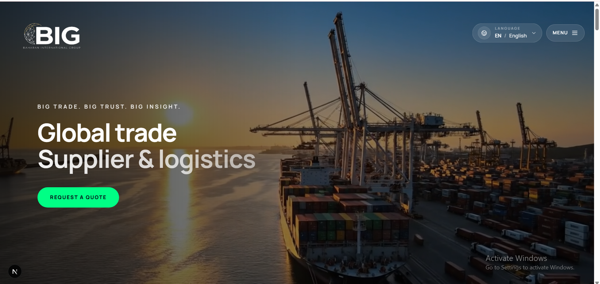
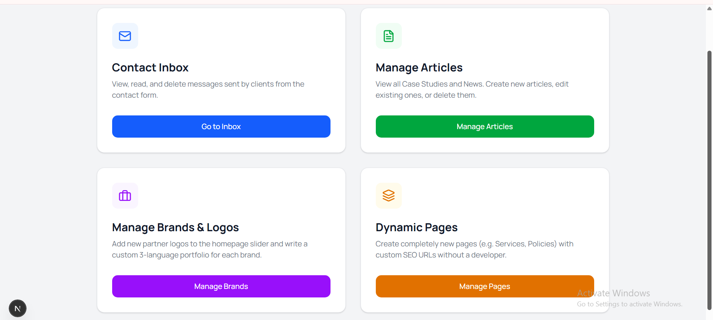
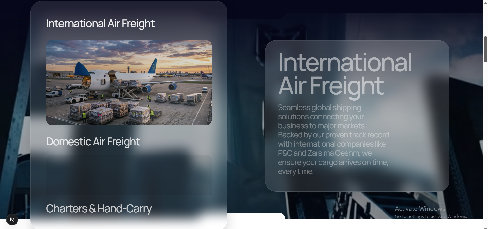
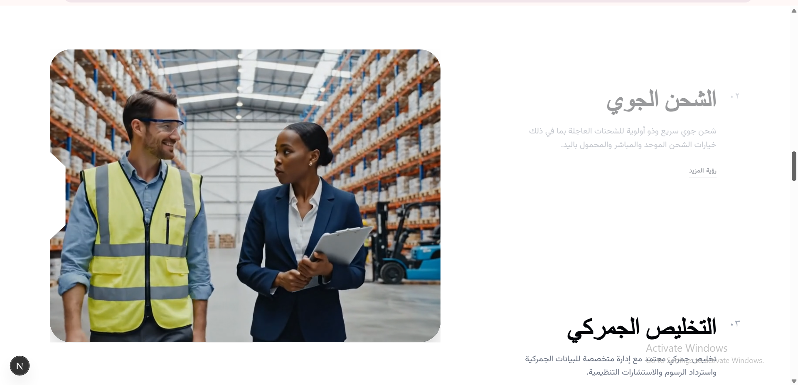
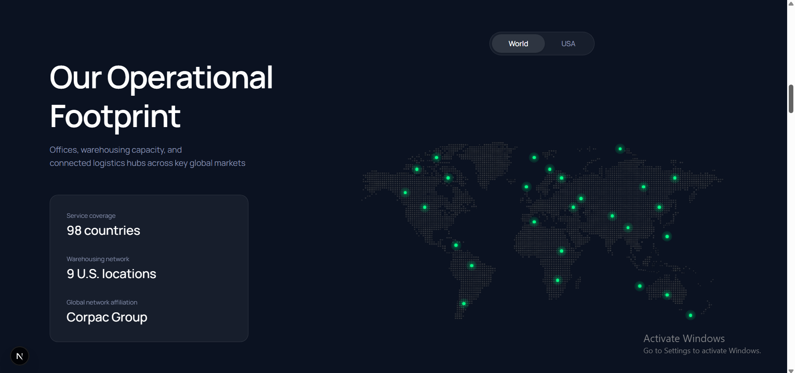

<div align="center">
  

  <h1>Tranzport Global Logistics Platform</h1>

  <p><b>An Enterprise-Grade, Multilingual Freight Forwarding & Logistics Web Application</b></p>

  <p>
    
    
    
    
  </p>

  <p>
    <a href="#-getting-started">View Live Demo</a>
    ·
    <a href="https://github.com/arvinameri/tranzport-global-logistics/issues">Report Bug</a>
    ·
    <a href="https://linkedin.com/in/arvin-ameri">Connect on LinkedIn</a>
  </p>
</div>

---

## 📸 Platform Previews

|                           Homepage & Global Network                            |                          Enterprise Admin Dashboard                          |
| :------------------------------------------------------------------------------: | :------------------------------------------------------------------------------: |
|         |  |
|                         **Interactive Services Grid**                          |                       **Dynamic Localization (i18n)**                        |
|  |       |

<p align="center"><i>Screenshot showing the interactive map section</i></p>
<p align="center">
  
</p>

---

## 🧭 Overview

**Tranzport Global Logistics** is a scalable, SEO-optimized, and fully localized enterprise web platform built for modern freight forwarding companies.

Engineered with **Next.js (App Router)**, the platform serves as a unified digital ecosystem featuring comprehensive public-facing logistics services (Air, Ocean, Domestic, Customs), interactive UI components, and a secure, custom-built internal **Admin Dashboard** for dynamic content management.

### 🌍 Core Capabilities

- **Enterprise Multilingual (i18n):** Native support for dynamic language switching with automatic UI reflow (RTL/LTR).
- **Secure Admin CMS:** Custom-built dashboard with robust authentication, JWT sessions, and a rich-text integrated TipTap editor for managing News, Brands, and Case Studies.
- **High-Performance Architecture:** Server-Side Rendering (SSR) and Static Site Generation (SSG) via Next.js for flawless SEO and sub-second load times.
- **Interactive UI/UX:** Built with Tailwind CSS, featuring custom hooks (`useScroll`, `useMousePosition`) for advanced sticky scrolling, text reveals, and interactive grid layers.

---

## 🧱 Tech Stack

| Layer              | Technologies Used                                     |
| :----------------- | :------------------------------------------------------ |
| **Core Framework** | Next.js (App Router), React 18, TypeScript             |
| **Styling & UI**   | Tailwind CSS, PostCSS, Custom Animations (Framer/CSS)   |
| **State & Logic**  | React Hooks, Zustand (via `store/index.ts`)             |
| **Backend API**    | Next.js Route Handlers (`app/api/*`)                    |
| **Database & ORM** | Custom DB Client (`lib/db.ts`)                          |
| **Content Editor** | TipTap Rich Text Editor (Admin Panel)                   |

---

## ✨ Key Features

### Client-Facing Platform

- **Comprehensive Service Routes:** Dedicated interactive pages for Ocean Freight, Air Freight, Customs Brokerage, Warehousing, and Project Cargo.
- **Dynamic Case Studies & News:** Auto-generated dynamic routes (`[slug]/page.tsx`) fetched directly from the database.
- **Interactive Maps & Video Heroes:** Embedded ambient videos (`hero.mp4`, `air-freight-loop.mp4`) and global interactive map components.

### Secure Admin Dashboard

- **Content Management:** Fully modular CRUD operations for Articles, Brands, and Static Pages.
- **Media Upload Pipeline:** Dedicated API routes (`api/admin/upload/route.ts`) for handling high-resolution enterprise assets.
- **Role-Based Access:** Protected routes and API middleware ensuring state-of-the-art security against unauthorized access.

---

## 📁 Project Structure

```text
Tranzport-Global-Logistics/
├── app/
│   ├── [lang]/               # Localized public views (i18n routing)
│   │   ├── admin/            # Secure CMS (Dashboard, Articles, Brands)
│   │   ├── ocean-freight/    # Domain-specific logistics pages
│   │   └── ...
│   ├── api/                  # Backend REST APIs (Admin & Client)
│   └── i18n.ts               # Translation configuration layer
├── components/
│   ├── admin/                # CMS UI (Forms, TipTap Editor)
│   ├── home/                 # Interactive landing components
│   └── layout/               # Header, Footer, FullScreenMenu
├── hooks/                    # Custom React hooks (useScroll, etc.)
├── lib/                      # Database and utility functions
└── public/
    └── assets/               # Enterprise media (Videos, Hi-Res Images)
```

---

## 🚀 Getting Started

### Prerequisites

- Node.js ≥ 18.x
- npm or yarn

### 1 — Clone & Install

```bash
git clone https://github.com/arvinameri/tranzport-global-logistics.git
cd tranzport-global-logistics/client
npm install
```

### 2 — Environment Variables

Create a `.env` file in the root of the `client` directory:

```env
DATABASE_URL="your_database_url_here"
NEXT_PUBLIC_API_URL="http://localhost:3000/api"
ADMIN_JWT_SECRET="your_secure_secret"
```

### 3 — Local Development

```bash
npm run dev
```

*Navigate to **http://localhost:3000** to view the application.*

---

## 📄 License

This project was developed as a proprietary logistics and web3-ready platform. The source code is shared strictly for portfolio and demonstration purposes.

---

<div align="center">
  <h3>Built by Arvin Ameri</h3>

  <p>📍 Zanjan, Iran &nbsp;|&nbsp; Full-Stack Developer & Software Engineer</p>

  <p>
    <a href="https://linkedin.com/in/arvin-ameri">
      
    </a>
    <a href="https://github.com/arvinameri/tranzport-global-logistics">
      
    </a>
  </p>
</div>
